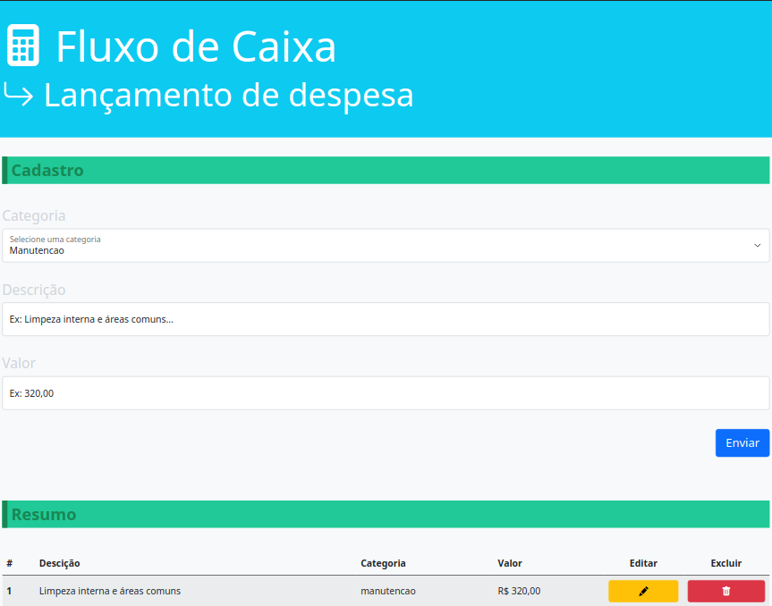

# Cash Flow



### Sobre
 
Simples crud como base de estudo para se fazer uso TypeScript. Em suma, estudando TypeScript...

### Tecnologias

- Sass
- Bootstrap
- TypeScript 

### 💻 Pré-requisitos

- Ter Node instalado.

### 🚀 Instalando Cash Flow

1. Primeiramente clone o repositório:
    ```
    git clone git@github.com:chen-zhenn/cash-flow.git
    ```

2. Instalar dependências necessárias:
    ```
    npm install
    ```

3. Fazer um cópia do arquivo tsconfig.json.example que se está no diretório front-end renomeando o mesmo para tsconfig.json  
<br />  

4. Rodar o projeto:
    ```
    npm start
    ```

> Importante: Executar passos 2 e 4 em ambos os diretórios - back-end e front-end

